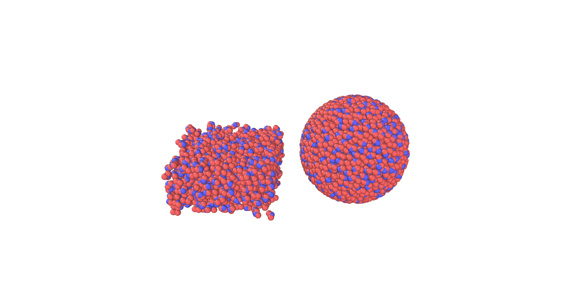

# Pack water
pack-water a package for water packing, which relies on [the Packmol package](http://m3g.iqm.unicamp.br/packmol/home.shtml). It is ment to be used as input to LAMMPS for molecular dynamics simulations. The inputs include number of molecules, length of box/density of water and whether or not the packed water should support periodic boundary conditions. However, the package supports cubic shapes only. 

## Installation
First download the contents:
``` bash
$ git clone https://github.com/evenmn/pack-water.git
```
and then install pack-water:
``` bash
$ cd pack-water
$ pip install .
```

## Prerequisites
- [Packmol](http://m3g.iqm.unicamp.br/packmol/home.shtml)

## Example usage
The package is very straightforward to use:

``` python
from pack_water import PackWater
from pack_water.geometry import SphereGeometry, BoxGeometry
    
packer = PackWater()
packer.append(BoxGeometry(0, 0, 0, 40, 40, 20, density=0.998,  side='in'))
packer.append(SphereGeometry(70, 20, 20, 20, number=2000,  side='in'))
packer(pbc=3.0, outfile="data.out")
```

This Python script gives the following output:

